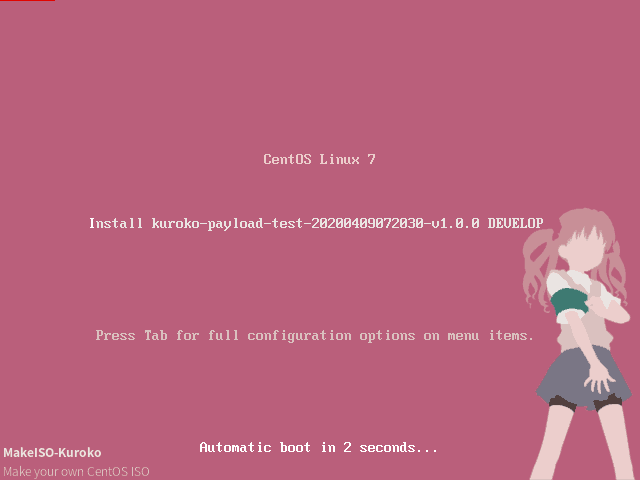
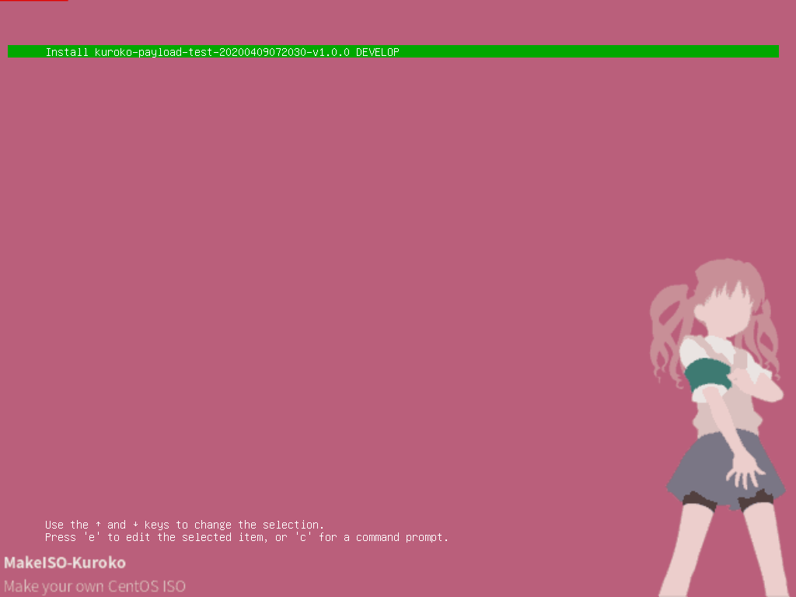

# Makeiso Kuroko

[](https://996.icu)

这是用于制作属于你自己的 CentOS ISO 的工具。

本脚本只针对于 CentOS-7.3.1611。

## Screenshot

### BIOS 模式



### UEFI 模式



## 依赖

- 可用的 Linux 操作系统。建议使用 CentOS 7.5.1804 或更新版本，因为其默认包含 rsync 3.1.1+
- CentOS-7-x86_64-Everything-1611.iso 光盘镜像
- genisoimage （包含在 CentOS-7-x86_64-Everything-1611 光盘镜像中）
- createrepo （包含在 CentOS-7-x86_64-Everything-1611 光盘镜像中）
- rsync 3.1.1+ （不包含在 CentOS-7-x86_64-Everything-1611 光盘镜像中，这个仓库中包含了一个 3.1.2 版本的 RPM 包）

## 使用方式

推荐顺序：

1. 修改全局变量
2. 将需要安装的额外文件放入 `PAYLOAD_PATH`，并编写一个 install.sh 用于在目的机上安装。**请注意不要包含任何交互性操作**。
3. 执行 makeiso.sh 生成 iso 文件（需要超级用户权限，因为要 mount iso）

### 全局变量

```
# INPUT
CENTOS7_EVERYTHING_ISO='/tmp/mountpoint/samba/share/CentOS-7-x86_64-Everything-1611.iso'
CENTOS7_EVERYTHING_ISO_MOUNTPOINT='/tmp/mountpoint/CentOS7-Everything-1611/'
PAYLOAD_PATH='./payload_sample/'
CONFIGDIR='boot.template/develop/'

# OUTPUT
NAMEPREFIX='PAYLOAD'
OUTPUTFILEDIR='./'
VERSION='v1.0.0'
TIMEZONE='UTC'

# Auto generated variables
VOLUMENAME=$NAMEPREFIX'-'`date +'%Y%m%d%H%M%S'`'-'$VERSION
VOLUMENAME_LABEL=`expr substr ${VOLUMENAME} 1 16`
FINALNAME=${VOLUMENAME}.iso
```

- **CENTOS7_EVERYTHING_ISO**: 必须指定为可访问的 CentOS-7-x86_64-Everything-1611.iso
- **PAYLOAD_PATH**: 为将要在系统安装完成后安装的包。在目的机系统安装并重启后，会执行一次 `bash install.sh`
- **VOLUMENAME_LABEL**: 卷标，最多支持16个字符

### 调用

```
Usage: ./makeiso.sh -d [DEST_DIR=./] -v [RELEASE_VERSION=v1.0.0] -s [PAYLOAD_PATH=/root/payload_sample/] -7 [CENTOS7_EVERYTHING_ISO=/root/iso/CentOS-7-x86_64-Everything-1611.iso] -z [TIMEZONE=UTC]
```

示例 1：

`./makeiso.sh -7 /root/cifs/CentOS/CentOS-7-x86_64-Everything-1611.iso`

示例 2：

`./makeiso.sh -d /root/ -v test20200331 -s ./payload_sample/ -7 /root/cifs/CentOS/CentOS-7-x86_64-Everything-1611/CentOS-7-x86_64-Everything-1611.iso -z 'Asia/Shanghai'`

之后你就会得到一个 ISO 文件。默认 root 密码为 'makeiso-kuroko' 。

**修改 root 密码请参考 [rootpw - Set Root Password](https://docs.fedoraproject.org/en-US/Fedora/html/Installation_Guide/sect-kickstart-commands-rootpw.html)**

**请注意，在 kickstart-post(payload-develop.cfg) 脚本中启用了所有网口的 DHCP。在安装向导配置的网络属性都不会在重启后生效。**

**在 kickstart-post 中不包含任何关于安装位置的配置。安装时仍需手动选择安装位置**


* * *

## 文件说明

### 打包程序

```
.
├── 83b61f9495b5f728989499479e928e09851199a8846ea37ce008a3eb79ad84a0-c7-minimal-x86_64-comps.xml
├── boot.template
│   └── develop
│       ├── EFI
│       │   └── BOOT
│       │       ├── grub.cfg
│       │       └── x86_64-efi
│       │           └── gfxterm_background.mod
│       └── isolinux
│           ├── isolinux.cfg
│           ├── payload-develop.cfg
│           ├── splash.png
├── d918936f5019be3fb66e9981a28cb2a41477a2963d741d454f79377a22214f43-c7-x86_64-comps.xml
├── filelist
│   ├── centos_dvd_frame.list
│   └── minimal.list
├── generatefilelist.sh
├── makeiso.sh
├── payload_sample
│   └── install.sh
└── rsync-3.1.2-5.fc26.x86_64.rpm
```

- payload-develop.cfg ，Kickstart文件，包括系统自动安装的细节设定，系统语言，网络设置，root密码 等。系统重启后会调用的脚本也包含在内。
- centos_dvd_frame.list ，CentOS7 光盘框架基础文件
- minimal.list ，所有需要从 Everything光盘 中获取的 RPM 包
- generatefilelist.sh ，用于从已有环境获取 RPM 包列表并与 Everything 光盘比对的脚本，可用于生成 `your_rpm_payload.list`. **注意 MBR 和 EFI 之间是有区别的！**

### ISO

```
.
├── CentOS_BuildTag
├── EFI
│   ├── BOOT
│   │   ├── BOOTX64.EFI
│   │   ├── fonts
│   │   │   ├── TRANS.TBL
│   │   │   └── unicode.pf2
│   │   ├── grub.cfg
│   │   ├── grubx64.efi
│   │   ├── MokManager.efi
│   │   └── TRANS.TBL
│   └── TRANS.TBL
├── EULA
├── GPL
├── images
│   ├── efiboot.img
│   ├── pxeboot
│   │   ├── initrd.img
│   │   ├── TRANS.TBL
│   │   └── vmlinuz
│   └── TRANS.TBL
├── isolinux
│   ├── boot.cat
│   ├── boot.msg
│   ├── grub.conf
│   ├── initrd.img
│   ├── isolinux.bin
│   ├── isolinux.cfg
│   ├── memtest
│   ├── payload-develop.cfg
│   ├── splash.png
│   ├── TRANS.TBL
│   ├── vesamenu.c32
│   └── vmlinuz
├── LiveOS
│   ├── squashfs.img
│   └── TRANS.TBL
├── Packages
│   ├── *.rpm
├── PAYLOAD
│   ├── install.sh
│   ├── *
├── repodata
│   ├── *
│   ├── repomd.xml
│   └── TRANS.TBL
├── RPM-GPG-KEY-CentOS-7
├── RPM-GPG-KEY-CentOS-Testing-7
└── TRANS.TBL
```

### 目的机 root
```
.
├── anaconda-ks.cfg
├── initial-setup-ks.cfg
├── initstart_flag.log
├── initstart.log
├── initstart.sh
├── kickstart-post.log
├── original-ks.cfg
├── PAYLOAD
│   ├── install.sh
│   └── *
├── payload_install.log
├── payload_log_sample.log
└── rpm_qa.list
```

- anaconda-ks.cfg 本次安装流程生成的 kickstart 文件
- initial-setup-ks.cfg 本次安装流程生成的 kickstart 文件（如果你安装了 GUI 界面）
- kickstart-post.log 本次安装过程中 kickstart post 脚本的运行日志
- initstart.sh，在目的机系统安装并重启后会执行的文件，包括'禁用 YUM 源'，'安装 PAYLOAD'，以及将其从`/etc/rc.d/rc.local`中移除
- initstart_flag.log，`initstart.sh` 的运行结果
- initstart.log，`initstart.sh` 的运行日志
- PAYLOAD，PAYLOAD的目录
- payload_install.log，PAYLOAD 下 install.sh 的执行日志
- payload_log_sample.log，PAYLOAD 下 install.sh 的输出（如果你使用了自带的 payload_sample）
- rpm_qa_develop.list 本次安装过程中安装的 RPM 包

## 开发建议

对于不涉及 CentOS7 安装光盘的操作，建议都放置于 PAYLOAD 目录下，由 install.sh 调用；

对于需要修改 CentOS7 安装光盘的依赖环境的，需要首先在新环境下安装 CentOS7，并使用 generatefilelist.sh 生成新的 rpm filelist，并更新 kickstart 和 comps.xml （或者干脆写到 Payload 的 install.sh 中。 It's fine.）。

项目自带 CentOS-7-x86_64-Everything-1611 的 comps.xml 文件，酌情使用。

本项目目的在于帮助对于不熟悉 CentOS 打 ISO 安装光盘的开发者学习和快速实现。您应该根据自己的项目需要，编写自己的 Kickstart 文件（payload-develop.cfg）。

## 其他

### 项目名 Kuroko

此项目只支持生成基于 CentOS 7.3.1611 版本。 公历年 1611 是伽利略发表对太阳黑子观察相关的年份。于是取名白井黑子。

### 目录名 Payload

我将这个项目 folk 给了公司的另一个项目组，并给这个目录取名 Payload 。Payload 意思是装载，在游戏 守望先锋 中，一般都是指 推车。这个目录的意思就是用来承载第三方的额外包。

但是，Payload 在游戏 TF2 中意味着 Bomb。我看了另一个组的代码之后，我觉得这就是个 Bomb ["Bomb is friend! Come, visit friend!"](https://wiki.teamfortress.com/w/images/2/2b/Heavy_cartstaycloseoffense06.wav)

### Todo list

- 将输出显示到 tty，而不是仅仅保存于日志
- 使用 Systemd 替换 rc.local

## 参考资料

- [GRUB 2 Custom Splash Screen on RHEL 7 UEFI and Legacy ISO Image](http://www.tuxfixer.com/set-grub2-custom-splash-screen-on-rhel-7-centos-7-uefi-and-legacy-bios-iso-image/)
- [Grub2/Displays](https://help.ubuntu.com/community/Grub2/Displays#Troubleshooting_Splash_Images)
- [rootpw - Set Root Password](https://docs.fedoraproject.org/en-US/Fedora/html/Installation_Guide/sect-kickstart-commands-rootpw.html)

## Contribution

任何贡献都是受欢迎的. 请向 分支**dev** 发起 Pull request 。

## License

Makeiso-Kuroko 使用基于 MIT License 构建的 反996许可证版本1.0

默认背景图片来自：["Toaru Kagaku no Railgun - Shirai Kuroko" by Krukmeister](https://krukmeister.deviantart.com/art/Toaru-Kagaku-no-Railgun-Shirai-Kuroko-369206997) 并且其 License 为
[Creative Commons Attribution-Noncommercial-No Derivative Works 3.0 License](http://creativecommons.org/licenses/by-nc-nd/3.0/).

如果您出于 **商业目的** 使用本项目，您应该 **移除** 或 **替换** 默认背景图片。
